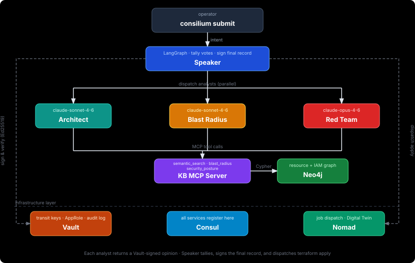

<p align="center">
  
</p>

# Consilium

**A parliament of AI agents that deliberates over proposed Terraform changes.**

Instead of a single AI rubber-stamping infrastructure decisions, Consilium runs five agents — each with a distinct brief and a cryptographic signing key — over every proposal. The **Architect** drafts; **Blast Radius**, **Red Team**, and **Generalist** vote; the **Speaker** orchestrates the debate, tallies the signed opinions, and either dispatches `terraform apply` or blocks with a cryptographic audit trail that explains exactly why.

The goal is a repeatable, auditable gate for Terraform changes: one that can catch IAM over-privilege, blast-radius surprises, cost blow-ups, and security regressions before they reach production infrastructure.

Status: **pre-MVP** — milestone M1 complete (KB + MCP server). See [TODO.md](./TODO.md).

---

## What problem does this solve?

Terraform `apply` is irreversible for many resource types. A single misconfigured IAM policy, a public S3 bucket, or a security-group rule left open can silently ship to production. Human PR review catches some of these, but reviewers are slow, inconsistent, and fatigued by large plans.

Consilium gives every proposed change a **structured deliberation**:

1. An **Architect** reads the operator's intent, consults a knowledge base of HashiCorp best practices, and produces a concrete Terraform proposal. (Does not vote.)
2. A **Blast Radius** agent maps the proposal against the live resource graph to enumerate everything that would change transitively — including resources the operator may not have considered. *(Hard-veto voter.)*
3. A **Red Team** agent adversarially probes the proposal for privilege escalation paths, data-exposure risks, and misconfigurations. *(Hard-veto voter.)*
4. A **Generalist** agent consults deterministic tools covering cost, policy-as-code, prior-incident precedent, and SLO impact, and raises concerns with tool citations. *(Soft-concern voter — can raise concerns but cannot veto.)*
5. A **Speaker** collects the three signed opinions, applies a quorum rule, and either signs a `PROCEED` record and fires `terraform apply`, or issues a signed `REJECTED` record with structured findings. (Does not vote.)

Every artefact in the deliberation — each agent's opinion, the final decision, the audit record — is signed by a non-exportable Ed25519 key held in Vault. The `consilium audit verify` command cryptographically replays the chain after the fact, making the decision tamper-evident.

> **Why three voters and not four?** See [docs/voting-architecture.md](./docs/voting-architecture.md) for the design decision — in short, fewer voters with richer tools beats ensemble fragmentation, policy-as-code is deterministic (belongs in a tool, not a voter), and three voters keeps the false-veto arithmetic below the noise floor.

---

## The demo (what this builds toward)

Four scenes, scripted in [MVP_PLAN §2.3](./MVP_PLAN.md):

1. **Happy path** — a benign EC2 resize sails through all three voters, Speaker signs `PROCEED`, `terraform apply` fires.
2. **Veto** — an IAM wildcard change is blocked by Red Team. Speaker issues a signed `REJECTED` record with Red Team's findings. No apply fires.
3. **Soft concern** — a change that passes Red Team and Blast Radius but triggers a Generalist `cost_estimate` concern. Speaker signs `PROCEED` with the concern attached to the audit record; apply still fires. Demonstrates the soft-concern mechanic.
4. **Audit** — `consilium audit verify <deliberation-id>` cryptographically replays the vetoed decision, verifying every signature in the chain.

---

## Architecture at a glance



| Component | Role | Votes? | Tech |
|---|---|---|---|
| **Speaker** | Orchestrator — dispatches, tallies, signs, applies | no | LangGraph + FastAPI |
| **Architect** | Proposes Terraform HCL from operator intent | no | Claude (Sonnet 4.6) |
| **Blast Radius** | Traverses resource-dependency graph | hard-veto | Claude + Neo4j |
| **Red Team** | Adversarial security probe | hard-veto | Claude (Opus 4.6) |
| **Generalist** | Cost / policy / precedent / SLO synthesis with tool citations | soft-concern | Claude (Sonnet 4.6) |
| **KB MCP server** | Exposes `semantic_search`, `blast_radius`, `security_posture`, `cost_estimate`, `policy_check`, `historian_lookup`, `slo_impact` tools | — | FastMCP + Neo4j |
| **Digital Twin** | Runs `terraform plan` against a state copy | — | Nomad job |
| **Control plane** | Agent registration, quorum policy, deliberation API | — | FastAPI |
| **Vault** | Transit signing keys (Ed25519), AppRole auth, file audit | — | HashiCorp Vault |
| **Consul** | Service discovery for all agents and the MCP server | — | HashiCorp Consul |
| **Nomad** | Job dispatch — runs agent containers and the Digital Twin | — | HashiCorp Nomad |
| **Neo4j** | Resource and IAM graph backing `blast_radius` / `security_posture` / `historian_lookup` | — | Neo4j 5 |

Voter classes and the full quorum table are explained in [docs/voting-architecture.md](./docs/voting-architecture.md).

---

## Deployment steps

### Prerequisites

| Tool | Minimum version | Purpose |
|---|---|---|
| Docker Desktop (or Engine) | 25+ | Runs the local HashiCorp stack |
| Vault CLI | any | Bootstraps transit keys and AppRoles |
| curl + jq | any | Used inside `bootstrap.sh` |

> See [CONTRIBUTING.md](./CONTRIBUTING.md) for the full toolchain table (Go, Python, Terraform).

### Task runner (recommended)

All deployment and demo steps are wrapped in a [Taskfile](./Taskfile.yml). Install [Task](https://taskfile.dev/installation/) once and use `task <name>` instead of the raw commands below.

```bash
brew install go-task          # macOS
# or: sh -c "$(curl --location https://taskfile.dev/install.sh)" -- -d -b ~/.local/bin

task                          # list all available tasks
task dev                      # full dev setup in one shot (up + bootstrap + seed)
task stack-health             # verify all five services are reachable
task mcp                      # start the KB MCP server (separate terminal)
task test                     # run unit tests
task test-integration         # run integration tests (requires stack + MCP server)
task demo-runbook             # pre-demo health check (run the night before recording)
```

The raw commands are documented below for reference; prefer `task` for day-to-day use.

### 1. Start the local stack

```bash
docker compose -f dev/docker-compose.yml up -d
```

Starts four containers:

| Container | Port | What it does |
|---|---|---|
| `consilium-vault` | 8200 | HashiCorp Vault in dev mode. Holds all six agent signing keys (Ed25519, non-exportable) and the AppRole credentials each agent uses to authenticate. Every `sign` and `verify` call is written to the file audit log at `/vault/logs/audit.log`. |
| `consilium-consul` | 8500 | HashiCorp Consul in dev mode. Each agent and the KB MCP server register here on startup. The Speaker uses Consul service discovery to locate analysts at deliberation time. |
| `consilium-nomad` | 4646 | HashiCorp Nomad in dev mode. Dispatches agent containers and the Digital Twin job when the Speaker calls `terraform apply`. |
| `consilium-neo4j` | 7687 / 7474 | Neo4j 5. Stores the Terraform resource dependency graph, IAM principal relationships, and prior-deliberation records used by the Blast Radius, Red Team, and Generalist agents (via `blast_radius`, `security_posture`, and `historian_lookup` MCP tools). |

All four services expose health checks; the compose file waits for each to be healthy before proceeding to dependents.

To use the slim stack (Vault + Consul + Nomad only, no Neo4j — saves ~1.5 GB RAM):

```bash
docker compose -f dev/docker-compose.slim.yml up -d
```

### 2. Bootstrap Vault and Neo4j

```bash
./dev/bootstrap.sh
```

This script is **idempotent** — safe to re-run at any time. It:

1. **Enables the Vault transit secrets engine** at path `consilium/transit`. This is the engine that signs and verifies agent artefacts.
2. **Creates six Ed25519 transit keys** — one per agent identity: `speaker`, `architect`, `blast_radius`, `red_team`, `generalist`, `operator`. Keys are `derived=false, exportable=false` — private key material never leaves Vault.
3. **Enables a file audit device** at `/vault/logs/audit.log` inside the Vault container. Every API call (sign, verify, token issue) is appended to this log.
4. **Enables AppRole auth** and creates one AppRole role per agent identity. Each role is bound to a policy that restricts it to signing under its own key only, plus read access to all public keys (needed for cross-agent verification).
5. **Applies the Neo4j schema** — unique constraints on `Resource.id` and `IamPrincipal.arn`, indexes on `Resource.type` and `Resource.provider`. (Skipped gracefully if the slim stack is running.)

To verify:

```bash
vault list consilium/transit/keys
# Expected: architect  blast_radius  generalist  operator  red_team  speaker
```

To wipe and rebuild Consilium-scoped Vault state (without touching other Vault tenants):

```bash
./dev/bootstrap.sh --reset
```

### 3. Seed the Neo4j knowledge graph (M1+)

```bash
pip install neo4j
python -m kb_extensions.seed.seed_neo4j
```

Loads a sample AWS web-tier Terraform graph into Neo4j:

- **10 Resource nodes**: `aws_vpc`, `aws_subnet` (×2), `aws_security_group`, `aws_instance` (×2), `aws_iam_role`, `aws_iam_instance_profile`, `aws_s3_bucket`, `aws_lb`
- **DEPENDS_ON edges** connecting them (e.g. instances depend on subnets, which depend on the VPC)
- **2 IamPrincipal nodes** with GRANTS edges to resources

This corpus is used by the `blast_radius` and `security_posture` MCP tools in integration tests and the live demo.

### 4. Start the KB MCP server (M1+)

```bash
pip install mcp neo4j httpx
python -m kb_extensions.mcp_server
```

Starts a [FastMCP](https://github.com/modelcontextprotocol/python-sdk) server on port 8000 that exposes seven tools to all Consilium agents:

| Tool | Primary consumer | What it does |
|---|---|---|
| `semantic_search` | Architect, Generalist | Keyword-ranked search over 15 HashiCorp best-practice doc snippets (local dev). Production path uses Amazon Kendra via `kb_extensions/base/server.py`. |
| `blast_radius` | Blast Radius agent | Traverses DEPENDS_ON edges in Neo4j from a root resource; returns all transitively impacted resources with distance and type. |
| `security_posture` | Red Team | Returns IAM principals with access to a resource and security findings (public access, missing encryption, exposed SSH port). |
| `cost_estimate` | Generalist | Returns monthly cost delta for the proposed HCL change (stubbed in MVP; real path integrates a cloud pricing API). |
| `policy_check` | Generalist | Runs deterministic policy-as-code (OPA/Sentinel) against the change; returns violations with severity and cited rule IDs. |
| `historian_lookup` | Generalist | Looks up past deliberations and incident records that match structural features of the proposed change. |
| `slo_impact` | Generalist | Returns SLO/change-window information for target resources (e.g. "inside the frozen window", "at-risk services"). |

On startup the server registers itself in Consul as `consilium-kb-mcp` (TCP health check on port 8000). Agents discover it via Consul rather than hard-coded addresses.

Verify Consul registration:

```bash
curl -s "http://localhost:8500/v1/health/service/consilium-kb-mcp?passing" | jq '.[].Service.ID'
```

Full tool contracts: [docs/mcp-tools.md](./docs/mcp-tools.md).

---

## Repository layout

```
consilium/
├── agents/
│   ├── base/          # Shared base class, signing helper, MCP client
│   ├── architect/     # Architect agent + system prompt (drafts; does not vote)
│   ├── blast_radius/  # Blast Radius agent (hard-veto voter)
│   ├── red_team/      # Red Team agent (hard-veto voter)
│   └── generalist/    # Generalist agent (soft-concern voter; cost/policy/historian/SLO)
├── control_plane/     # FastAPI control plane + Vault/Consul/Nomad wiring
├── kb_extensions/
│   ├── base/          # Vendored upstream MCP server (Kendra + Neptune reference)
│   ├── seed/          # Neo4j seed script + local doc corpus
│   └── mcp_server.py  # Consilium local MCP server
├── cli/               # `consilium` CLI (submit, audit verify)
├── provider/          # Terraform provider (Go, terraform-plugin-framework)
├── nomad/             # Nomad job specs for each agent and the Digital Twin
├── examples/          # Example Terraform parliament configurations
├── tests/
│   ├── unit/          # Fast, no network, no containers
│   └── integration/   # Require running stack; skipped in CI
├── docs/              # Tool contracts, architecture notes
└── dev/               # docker-compose files + bootstrap.sh
```

---

## Further reading

- [MVP_PLAN.md](./MVP_PLAN.md) — design rationale, milestone breakdown, quorum rules, observability spec
- [BUILD_PROMPT.md](./BUILD_PROMPT.md) — self-contained agent brief for building the stack
- [docs/voting-architecture.md](./docs/voting-architecture.md) — voter roles, quorum table, and the design decision behind "3 voters, not 4"
- [docs/mcp-tools.md](./docs/mcp-tools.md) — pinned MCP tool contracts
- [CONTRIBUTING.md](./CONTRIBUTING.md) — full dev workflow, conventions, pre-push checklist
